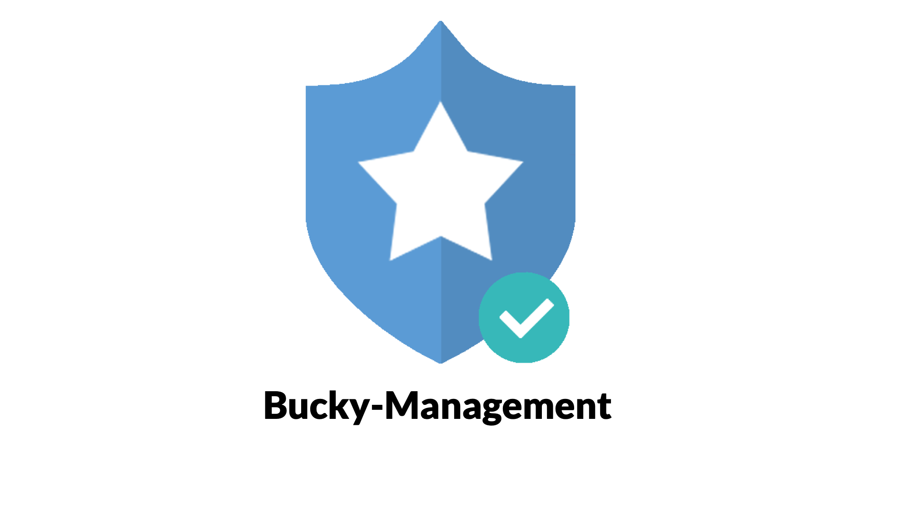

# Bucky-Management

[](https://codeclimate.com/github/lifull-dev/bucky-management/maintainability)

## Overview
Bucky-management is a web application that shows test result executed by [Bucky-core](https://github.com/lifull-dev/bucky-core).

## Getting Started
We prepare two docker-compose files to start up Bucky-managemnt.
- **docker-compose.yml**: Using DB container in docker-compose.yml
- **docker-compose.without_db.yml**: Using external DB

### Set environment variables
Take care of following points when setting environment variables:
- You must set RAILS_ENV, because it doesn't have default value
- Use default value when starting by docker-compose.yml
```bash
export RAILS_ENV=${RAILS_ENV} # e.g. production, development, test

# You don't need to export if you're going to use default value.
export BUCKY_DB_USERNAME=${BUCKY_DB_USERNAME} # default: root
export BUCKY_DB_PASSWORD=${BUCKY_DB_PASSWORD} # default: password
export BUCKY_DB_HOSTNAME=${BUCKY_DB_HOSTNAME} # default: db
```

### Build and start Bucky-management
```bash
# Use DB container
docker-compose up --build -d
# Use external DB
docker-compose -f docker-compose.without_db.yml up --build -d
```

### Migration database and table
```bash
# Only at first time not created DB yet.
docker exec -it bm-app rails db:create
# Do this if new migration file is added.
docker exec -it bm-app rails db:migrate
```

### Publish secret key base and set to environment variables
```bash
export SECRET_KEY_BASE=$(docker exec -it bm-app rake secret)

# Restart Bucky-management to reflect environment variables
docker-compose up --build -d
```

### Check your Bucky-management dashboard
http://localhost
